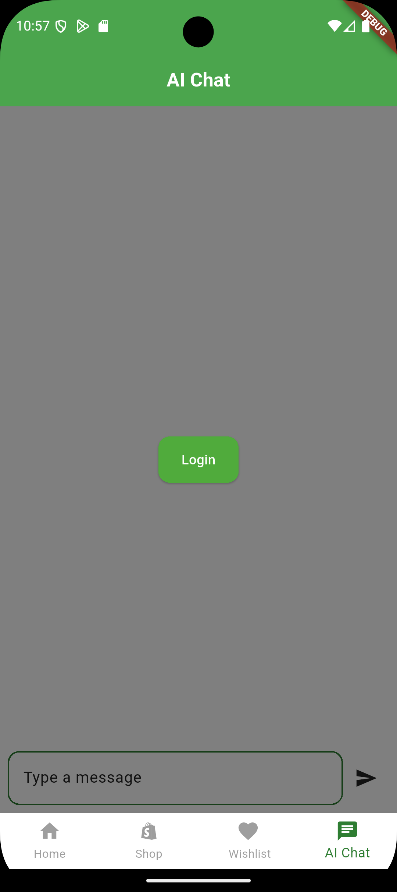

# Online Shop Mobile App

A cross-platform e-commerce mobile app built with **Flutter**, connecting to a custom **ASP.NET Core** backend API.

> ⚠️ **Status: Work in Progress**
> This project is **not a finished product**. It is under active development, several features are incomplete or being refined, and it is not yet ready for production or release.

## Overview

This app lets users browse products by category, manage a cart and wishlist, authenticate via email or social login, and chat with an AI assistant. It's built as a personal/learning project to practice Flutter development alongside a real backend integration.

## Features

- **Authentication** — email/password sign up & login, Google Sign-In, Facebook Login, forgot/reset password flow with verification codes
- **Shop & Categories** — browse products by category with filtering
- **Cart** — add/remove items, adjust quantities, persistent cart state
- **Wishlist** — save items for later
- **AI Chat** — in-app AI assistant (powered by `googleai_dart`)
- **User Profile** — view/edit user data, change password
- **Multi-language support** — powered by `easy_localization`, with an in-app language toggle
- **Backend integration** — talks to an ASP.NET Core REST API for auth, products, and branch/location data

## Tech Stack

- **Framework:** Flutter (Dart)
- **Backend:** ASP.NET Core (separate repo/service)
- **Key packages:**
  - `http` — API communication
  - `flutter_secure_storage` — secure token storage
  - `google_sign_in`, `flutter_facebook_auth` — social login
  - `cached_network_image` — image loading/caching
  - `easy_localization` — localization
  - `googleai_dart` — AI chat
  - `google_fonts`, `chat_bubbles`, `pinput`, `grouped_list` — UI

## Project Structure

```
lib/
├── data/            # Static/local data (branches, categories)
├── managers/        # API service, auth, and social-auth logic
├── screens/         # App screens (home, shop, cart, wishlist, profile, auth flows, chat, etc.)
├── widgets/         # Reusable UI components
└── main.dart        # App entry point
```

## Screenshots

| Home | Shop | Filter |
|------|------|--------|
|  |  |  |

| Cart | Product Details | Wishlist |
|--------------|------------------|----------|
|  |  |  |

| Profile |
|---------|
|  |

| Login | Sign Up | Forgot Password |
|-------|---------|------------------|
|  |  |  |

| AI Chat | AI Chat (Login Required) |
|---------|---------------------------|
|  |  |

## Getting Started

### Prerequisites

- [Flutter SDK](https://docs.flutter.dev/get-started/install) (Dart SDK ^3.11.0)
- A configured `.env` file (required for API keys / endpoints — not included in the repo)
- Access to the corresponding ASP.NET Core backend API

### Installation

```bash
git clone https://github.com/abdelrahman00204/Online-shop-Mobile-App.git
cd Online-shop-Mobile-App
flutter pub get
flutter run
```

### Notes

- Social login (Google/Facebook) requires your own OAuth credentials and platform configuration (key hashes, app IDs, etc.).
- The backend API is hosted on Azure. The app's `.env` file needs to point to that endpoint for auth, products, and other data to load.

## Known Limitations

- Not feature-complete — some screens and flows are still being built or fixed
- No automated CI/CD or release builds yet

## License

No license specified yet.
